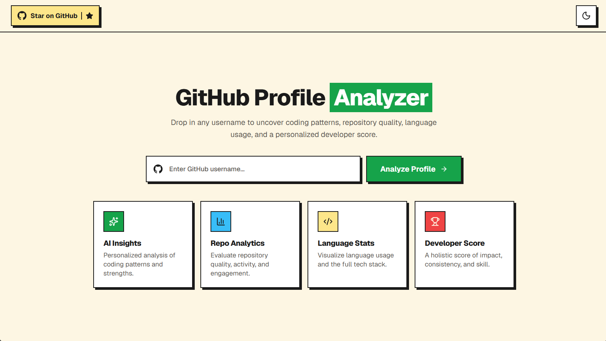
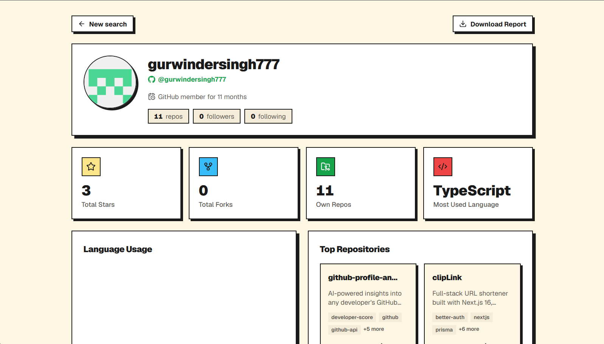
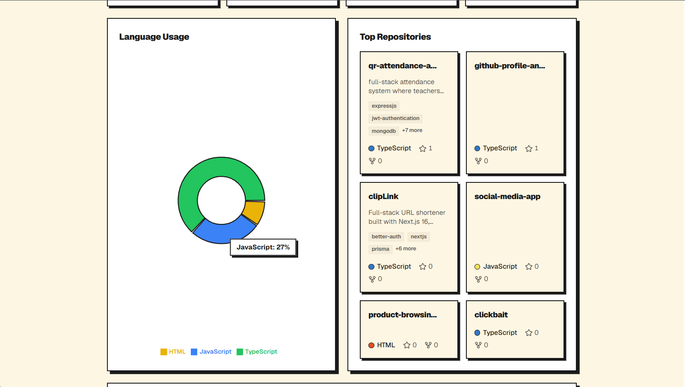
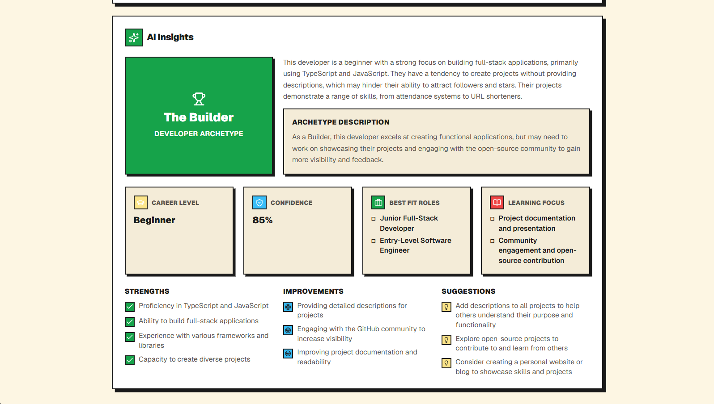
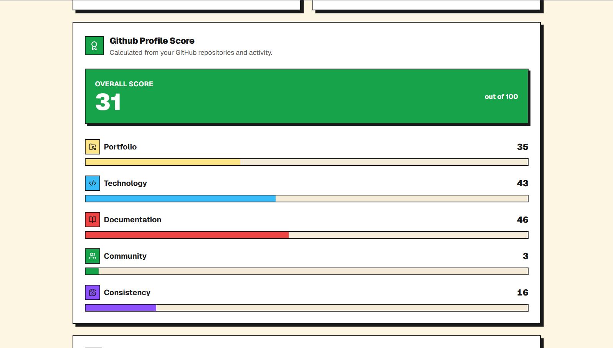

# GitHub Profile Analyzer + AI Insights


AI-powered insights into any public GitHub profile. Search a GitHub username and instantly receive a comprehensive profile analysis including repository statistics, language distribution, GitHub Profile Score, AI-generated career insights, and a downloadable developer report.

### 🌐 Live 

https://github-profile-analyzer-insights.vercel.app

---

# Screenshots

<p align="center"><b>Home</b></p>

<div align="center">

</div>

<br/>

<p align="center">
<b>Profile Overview</b> &nbsp;&nbsp;|&nbsp;&nbsp;
<b>Language Usage</b>
</p>

<div align="center">


</div>

<br/>

<p align="center">
<b>AI Insights</b> &nbsp;&nbsp;|&nbsp;&nbsp;
<b>GitHub Profile Score</b>
</p>

<div align="center">


</div>

<br/>

---

# Features

- 🔍 Analyze any public GitHub profile (no authentication required)
- 👤 Complete profile overview including bio, location, website, followers, following, repositories, and account age
- 📊 GitHub statistics including:
  - Total stars
  - Total forks
  - Repository count
  - Most-used language
- 📈 Interactive language distribution chart
- ⭐ Top repositories ranked by popularity with:
  - Description
  - Language
  - Stars
  - Forks
  - Topics
- 🤖 AI-generated developer insights powered by Groq:
  - Developer archetype
  - Professional summary
  - Strengths
  - Areas for improvement
  - Career suggestions
  - Learning roadmap
  - Best-fit roles
  - Confidence score
- 🏆 GitHub Profile Score (0–100) with category breakdown:
  - Portfolio
  - Technology
  - Documentation
  - Community
  - Consistency
- 📄 Download a beautifully designed GitHub Developer Report as an image
- ⚡ Independent loading states so GitHub data renders before AI insights
- 🚀 Instant repeat searches using TanStack Query caching
- 🌙 Dark / Light mode
- 📱 Fully responsive
- 💾 No database required

---

# Tech Stack

| Layer | Technology |
|--------|------------|
| Framework | Next.js (App Router) |
| Language | TypeScript |
| Styling | Tailwind CSS + shadcn/ui |
| State Management | TanStack Query |
| Charts | Recharts |
| Image Export | html-to-image |
| GitHub Data | GitHub REST API |
| AI | Groq API |
| Deployment | Vercel |

---

# How It Works

```text
User enters a GitHub username
            │
            ▼
Navigate to /[username]
            │
            ▼
GET /api/github/[username]
            │
            ▼
GitHub REST API
            │
            ▼
Process repositories
• Filter forks
• Ignore archived repos
• Calculate language usage
• Rank repositories
• Generate GitHub Profile Score
            │
            ▼
Render profile components
(Profile Header, Stats, Charts, Score, Repositories)
            │
            ▼
POST /api/analyze
            │
            ▼
Groq AI
            │
            ▼
Generate structured AI insights
            │
            ▼
User can download a GitHub Developer Report
```

---

# Getting Started

## Prerequisites

- Node.js 18+
- GitHub Personal Access Token (Classic, no scopes required)
- Groq API Key

---

## Installation

```bash
git clone https://github.com/gurwindersingh777/github-profile-analyzer.git

cd github-profile-analyzer

npm install
```

---

## Environment Variables

Create a `.env.local` file.

```env
GITHUB_TOKEN=your_github_token
GROQ_API_KEY=your_groq_api_key
```

---

## Run the project

```bash
npm run dev
```

Visit

```
http://localhost:3000
```

---

# Project Structure

```text
src
├── app
│   ├── [username]
│   ├── api
│   │   ├── analyze
│   │   └── github
│   ├── layout.tsx
│   └── page.tsx
│
├── components
│   ├── home
│   ├── profile
│   ├── export
│   ├── skeletons
│   ├── ui
│   └── providers.tsx
│
├── hooks
│
├── lib
│   ├── ai.ts
│   ├── github.ts
│   └── download.ts
│
└── types
```

---

# API

## GET `/api/github/[username]`

Returns processed GitHub profile data.

### Response

- User profile
- Repository statistics
- Language distribution
- Top repositories
- GitHub Profile Score

---

## POST `/api/analyze`

Generates AI insights from the processed GitHub profile.

Returns:

- Summary
- Archetype
- Strengths
- Improvements
- Suggestions
- Career level
- Confidence score
- Best-fit roles
- Learning focus

---

# GitHub Profile Score

The GitHub Profile Score is a deterministic score between **0–100** calculated entirely from GitHub profile data. It does **not** rely on AI.

| Category | Weight |
|----------|--------|
| Portfolio | 30% |
| Technology | 20% |
| Documentation | 20% |
| Community | 15% |
| Consistency | 15% |

The score evaluates repository quality, documentation, language diversity, community engagement, account maturity, and overall portfolio strength.

---

# Deployment

Deploy easily with Vercel.

1. Push the project to GitHub
2. Import the repository into Vercel
3. Configure:

```
GITHUB_TOKEN
GROQ_API_KEY
```

4. Deploy

---

# Future Improvements

- PDF export
- GitHub contribution calendar
- Compare two GitHub profiles
- Repository filtering
- More score metrics
- Shareable report links

---

# Author

**Gurwinder Singh**

GitHub: https://github.com/gurwindersingh777

---

If you found this project helpful, consider giving it a ⭐ on GitHub!