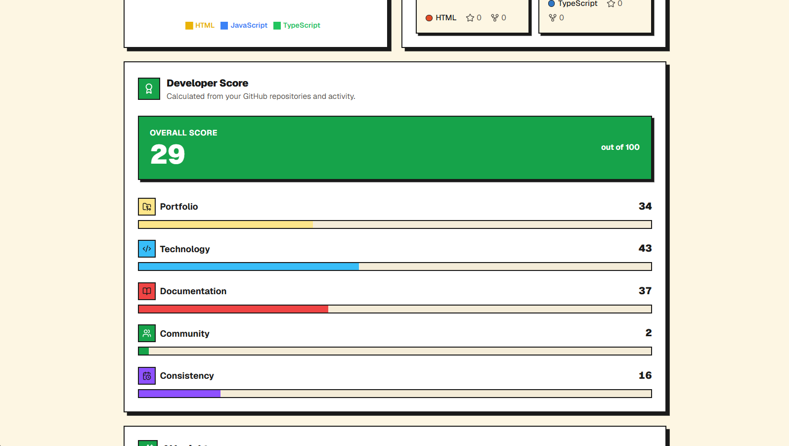

# GitHub Profile Analyzer + AI Insights


<div align="center">


</div>

AI-powered insights into any developer's GitHub profile. Enter a username and get a full breakdown of their stats, top languages, top repos, an AI-generated personality analysis, and a proprietary Developer Score 

**Live Demo:** https://github-profile-analyzer-insights.vercel.app

## Screenshots

<p align="center"><b>Home</b></p>
<div align="center">
  
</div>

<p align="center"><b>Profile Overview</b> &nbsp;|&nbsp; <b>Language Chart</b></p>
<div align="center">
  
  
</div>

<p align="center"><b>AI Insights</b> &nbsp;|&nbsp; <b>Developer Score</b></p>
<div align="center">
  
  
</div>

## Features

- Search any public GitHub username — no login required
- **Profile overview** — avatar, bio, location, links, follower/following counts, account age
- **Stats grid** — total stars earned, total forks, owned repo count, most-used language
- **Language breakdown** — Recharts pie chart from a developer's own (non-fork, non-archived) repos
- **Top repositories** — top 6 repos ranked by stars, with description, language, stars, forks, topics
- **AI insights (Groq)** — archetype, summary, strengths, areas to improve, suggestions, career level, confidence score, best-fit roles, learning focus
- **Developer Score** — a deterministic 0–100 score (plus 5 weighted sub-scores) computed entirely from real profile data
- GitHub star button + dark/light theme toggle
- Two independent loading states, so AI insights never block the GitHub stats from rendering
- Client-side caching via TanStack Query — searching the same username twice is instant
- Fully responsive · no auth · no database

## Tech Stack

| Layer | Technology |
|---|---|
| Framework | Next.js (App Router) |
| Language | TypeScript |
| Styling | Tailwind CSS + shadcn/ui |
| Data fetching | TanStack Query |
| Charts | Recharts |
| Data source | GitHub REST API |
| AI | Groq API (OpenAI-compatible SDK) |
| Deployment | Vercel |

## How It Works

```
User searches a username on the homepage
↓
Navigates to /[username]
↓
useGitHubProfile (TanStack Query) → GET /api/github/[username]
↓
Server fetches the user + repos from the GitHub REST API, filters
forks/archived repos, calculates language %, top repos, account
age, and the Developer Score
↓
ProfileHeader, StatsGrid, LanguageChart, TopRepos, and
DeveloperScore render immediately
↓
useAIInsights fires once GitHub data is available
↓
POST /api/analyze → Groq returns a structured JSON personality
analysis → AIInsights renders
```

## Getting Started

### Prerequisites

- Node.js 18.18 or later
- A [GitHub personal access token](https://github.com/settings/tokens) — classic token, no scopes needed
- A [Groq API key](https://console.groq.com/keys) — free tier available

### Installation

```bash
git clone https://github.com/gurwindersingh777/github-profile-analyzer.git
cd github-profile-analyzer
npm install
```

### Environment Variables

Create a `.env.local` file:

```bash
GITHUB_TOKEN=your_token_here
GROQ_API_KEY=your_key_here
```

### Run locally

```bash
npm run dev
```

Open [http://localhost:3000](http://localhost:3000).

## Project Structure

```
src/
├── app/
│   ├── [username]/page.tsx             # Profile analysis page
│   ├── api/
│   │   ├── analyze/route.ts            # Calls Groq, returns AI insights
│   │   └── github/[username]/route.ts  # Fetches + processes GitHub data
│   ├── layout.tsx
│   └── page.tsx                        # Homepage
├── components/
│   ├── home/                           # Search bar, feature cards, theme toggle
│   ├── profile/                        # Header, stats, chart, repos, AI insights, score
│   ├── skeletons/
│   ├── ui/                             # shadcn/ui primitives
│   └── provider.tsx                    # TanStack Query provider
├── hooks/                              # TanStack Query hooks
├── lib/
│   ├── ai.ts                           # Groq client + prompt builder
│   └── github.ts                       # GitHub API + data processing + Developer Score
└── types/index.ts
```

## API Reference

| Route | Method | Description |
|---|---|---|
| `/api/github/[username]` | GET | Fetches + processes GitHub profile data |
| `/api/analyze` | POST | Sends profile data to Groq, returns AI insights |

Errors: `404` user not found · `429` GitHub rate limit · `400` bad request · `500` server/Groq failure

## Developer Score

A deterministic 0–100 score, independent of the AI insights:

| Sub-score | Weight | Based on |
|---|---|---|
| Portfolio | 30% | Repo count, language diversity, stars |
| Documentation | 20% | % of repos with a description and topics |
| Technology | 20% | Language diversity, active repo count |
| Consistency | 15% | Account age, active repo count |
| Community | 15% | Followers, forks, stars |

## Deployment

1. Push to GitHub
2. Import the project on [Vercel](https://vercel.com/new)
3. Add `GITHUB_TOKEN` and `GROQ_API_KEY` in Project Settings → Environment Variables
4. Deploy


## Author

**Gurwinder**
GitHub: [@gurwindersingh777](https://github.com/gurwindersingh777) 